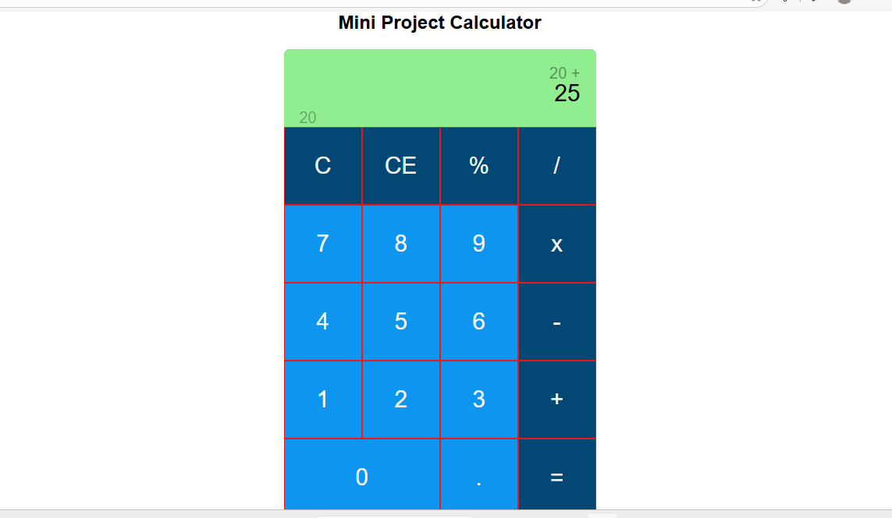

# 🌐 Live Demo

🔗 https://edwinalfadin.github.io/Mini-Project-Calculator/

# 🧮 Mini Project Calculator

A simple and responsive calculator built using HTML, CSS, and JavaScript. This project performs basic arithmetic operations with a clean and user-friendly interface.

---

## 📖 About

This calculator is designed to help users perform everyday mathematical calculations quickly and easily. It is lightweight, responsive, and works directly in the browser without requiring any installation.

---

## ✨ Features

- ➕ Addition
- ➖ Subtraction
- ✖️ Multiplication
- ➗ Division
- 🧹 Clear (AC) button
- ⌫ Delete last input
- 📱 Responsive design
- ⚡ Fast and lightweight

---

## 🛠️ Built With

- HTML5
- CSS3
- JavaScript (Vanilla JS)

---

## 📂 Project Structure

MINI-PROJECT-CALCULATOR/
│── img/
│── index.html
│── style.css
│── script.js
│── README.md

---

## 🚀 Getting Started

1. Clone the repository

bash
git clone https://github.com/EdwinAlfadin/Mini-Project-Calculator.git

2. Open the project folder.

3. Double-click *index.html* or open it using Live Server in VS Code.

---

## 📸 Screenshot

---

## 👨‍💻 Author

*Ahmad Edwin Alfadin*

Front-End Developer

GitHub: https://github.com/EdwinAlfadin

LinkedIn: https://linkedin.com/in/ahmad-edwin-alfadin-alfa

---

## ⭐ Show Your Support

If you like this project, don't forget to give it a ⭐ on GitHub.

---

## 📄 License

This project is licensed under the MIT License.
